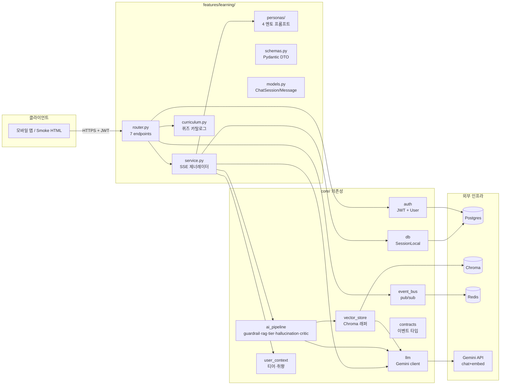
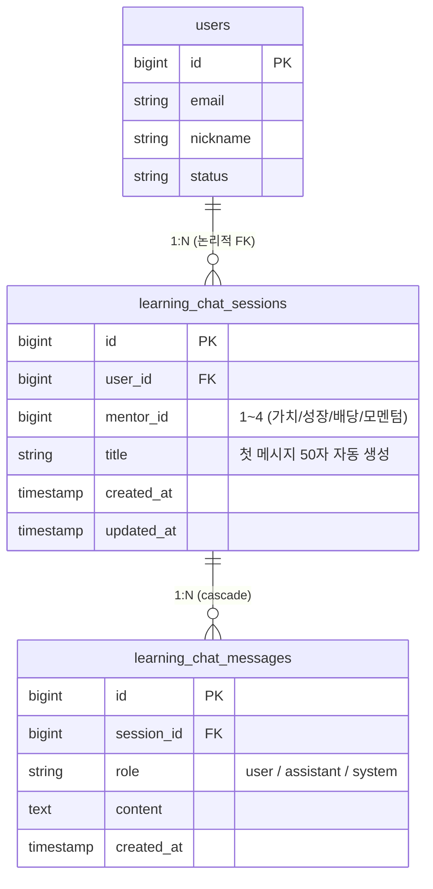
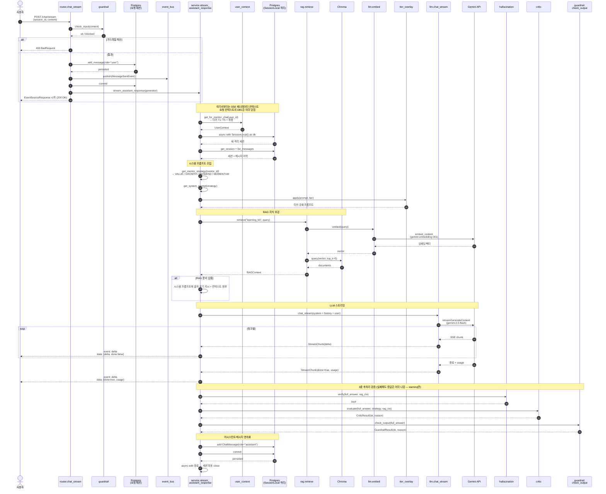
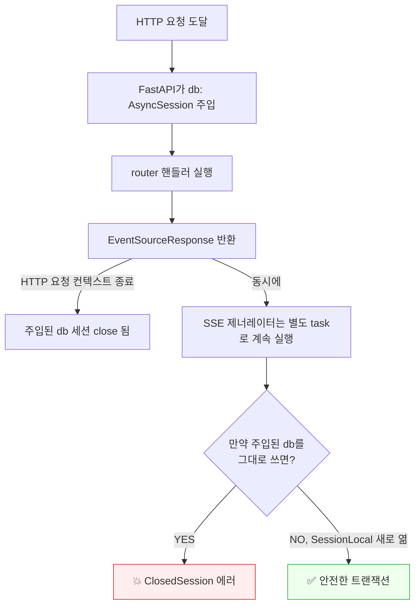
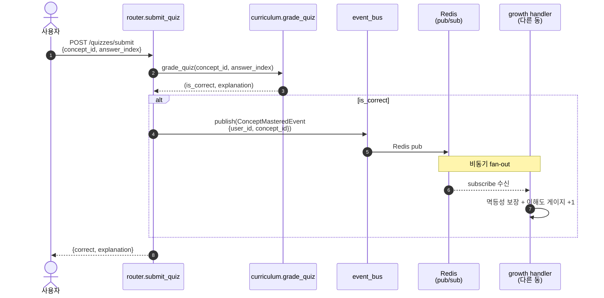
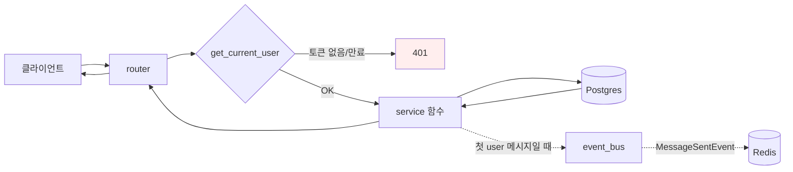

# 학습 동(Learning) 데이터 흐름도

> 본 문서는 `features/learning/` 모듈의 실제 코드를 기준으로 한 데이터 흐름 시각화이다.
> 기준 시점: 2026-05-20 / 로컬 워크스페이스 (`coreinfra/`) 기준.
> Mermaid 다이어그램은 GitHub·VS Code Preview·대부분 마크다운 뷰어에서 자동 렌더링된다.

---

## 1. 한눈에 — 학습 동의 우주

학습 동은 **자체 비즈니스 로직 (3 파일) + core/ 의존성 (8 모듈) + 외부 인프라 (4종)** 의 조합이다.

---

## 2. 데이터 모델

> **핵심 원칙** — `users.id`는 학습 동에서 **논리적 참조만**. 다른 동(growth, debate 등)과 직접 JOIN 금지. 동 간 통신은 `core.event_bus` 통해서만.

---

## 3. 7 엔드포인트 한눈에

| # | 메서드·경로 | 무엇 | 핵심 흐름 |
|---|---|---|---|
| 1 | `GET /api/learning/sessions` | 내 세션 목록 | DB 단순 조회 |
| 2 | `POST /api/learning/sessions` | 새 세션 생성 | DB INSERT |
| 3 | `GET /api/learning/sessions/{id}/messages` | 메시지 이력 | 소유 확인 + DB 조회 |
| 4 | `POST /api/learning/sessions/{id}/messages` | 메시지 저장(전용) | DB INSERT + `MessageSentEvent` |
| 5 | **`POST /api/learning/chat/stream`** | **실시간 멘토링 (SSE)** | **5단계 AI 파이프라인 → §4** |
| 6 | `GET /api/learning/quizzes/{concept_id}` | 퀴즈 조회 | 메모리 카탈로그 + 정답 숨김 |
| 7 | `POST /api/learning/quizzes/submit` | 퀴즈 채점 | 채점 + 정답시 `ConceptMasteredEvent` → §5 |

1~3·6은 단순 CRUD/조회라 별도 그림 없이 충분하다. 4·5·7만 다이어그램이 필요하다.

---

## 4. 핵심 흐름 A — 채팅 스트림 (`POST /chat/stream`)

가장 복잡한 경로. **입력 가드레일 → 사용자 메시지 저장 → SSE 제너레이터 시작 → 별도 DB 세션 진입 → RAG → 티어 오버레이 → Gemini 스트리밍 → 3중 후처리 검증 → 어시스턴트 답변 저장**.

### 4.1 왜 별도 `SessionLocal`을 여는가 (§5.2 설계 결정)

**규칙**: SSE/long-running 제너레이터 안에선 절대 의존성 주입된 `db`를 사용하지 말 것. `async with SessionLocal() as db:`로 새로 열어라.

---

## 5. 핵심 흐름 B — 퀴즈 채점 + 이벤트 발행 (`POST /quizzes/submit`)

가장 단순하면서도 **동 간 디커플링 패턴의 시범 케이스**.

**관찰 포인트**:
- 학습 동은 **growth 동의 코드를 직접 import 하지 않는다.** `core/contracts/`에 정의된 이벤트 타입(`ConceptMasteredEvent`)만 알 뿐.
- 정답 사용자가 즉시 응답을 받는 흐름은 이벤트 fan-out과 **독립적**이다. growth 동이 잠시 죽어 있어도 학습 동의 응답은 정상.
- 같은 사용자가 같은 개념 퀴즈를 여러 번 풀어도 growth 동이 **멱등성 키**로 한 번만 카운트해야 함 (학습 동의 책임 아님).

---

## 6. 단순 흐름 C — 세션·메시지 CRUD (1~4번 엔드포인트)

**짚을 점**:
- `list_messages`는 호출 전에 `get_session()`으로 **소유 확인** — 남의 세션 ID를 알아도 메시지를 읽을 수 없다. (`router.py` 75행과 `service.py` 78행)
- `add_message`가 **첫 사용자 메시지**일 때 세션 `title`을 자동 설정(첫 50자). 그래서 Swagger에서 본 세션 목록 제목 "PER이 뭐야? 두 문장으로..."이 자동 생성된 것.

---

## 7. 어디서 무엇이 결정되는가 — 한 줄 매핑

| 행동 | 결정 위치 | 비고 |
|---|---|---|
| "직접 추천 차단" | `core.ai_pipeline.guardrail.check_input` + `check_output` | 입력·출력 **양쪽** 검사 |
| "어떤 페르소나로 답하는가" | `features.learning.personas.get_mentor_strategy(mentor_id)` | 1→가치, 2→성장, 3→배당, 4→모멘텀, 그 외→가치 fallback |
| "어느 정도 난이도로 설명하는가" | `core.ai_pipeline.tier_overlay.apply(prompt, user_ctx.tier)` | T1~T5 |
| "어떤 지식을 참조할 것인가" | `core.ai_pipeline.rag.retrieve("learning_kb", query)` | Chroma 컬렉션 `learning_kb` |
| "어떤 모델로 응답할 것인가" | `core.llm.llm.chat_stream` + `core.config.settings.llm_provider` | provider="google" → gemini-2.5-flash |
| "정답인가" | `features.learning.curriculum.grade_quiz` | 단순 인덱스 비교 |
| "이해도 게이지 +1" | `growth` 동 핸들러 (학습 동은 알 바 아님) | 이벤트 구독 측 책임 |

---

## 8. 한계 / 향후 작업 (스냅샷 시점)

- **`hallucination.verify` / `critic.evaluate` / `guardrail.check_output`는 실패해도 warning만 남기고 응답은 그대로 사용자에게 보낸다.** 운영 모니터링 시점에 패턴이 잡히면 차단 모드로 전환 검토.
- **`learning_kb` Chroma 컬렉션은 비어 있다** (스모크 시점 기준 — `vector_store.upsert`를 부르는 코드 경로가 학습 동에 없음). RAG는 호출은 되지만 빈 결과를 받음. 운영 전에 초기 지식 베이스 적재 작업 필요.
- **`MessageSentEvent`의 구독자**가 아직 없다 (단순 발행만). 학습 분석/이해도 추정 용도로 활용 여지.
- **이벤트 멱등성** — `ConceptMasteredEvent`의 멱등성 키 정책은 growth 동에서 정해야 함. 학습 동은 단지 발행만.

---

## 9. 시각화 갱신 규칙

1. `features/learning/` 또는 `core/ai_pipeline/`에 새 단계가 추가되면 §4 sequence diagram을 갱신한다.
2. 새 엔드포인트가 추가되면 §3 표에 줄 추가, 필요시 §4·5 같은 핵심 흐름 다이어그램 추가.
3. 동 간 이벤트가 추가되면 §5와 §7 표에 반영.
4. 본 문서는 코드의 GA 시점 진실을 따라간다. 의도와 실제가 다르면 코드를 고치고 본 문서를 갱신.
